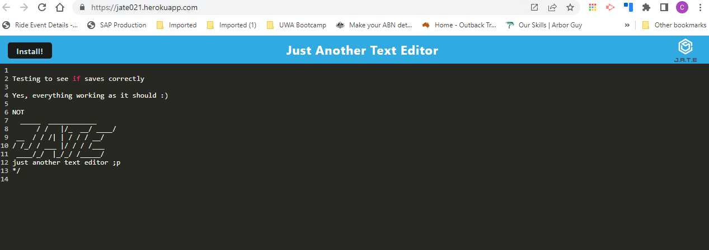

# JATE

  
## Description  

Simple Text Editor deployed to Heroku as a Progressive Web Application, using Webpack   

## Table of Contents

- [Installation](#installation-notes)
- [Usage](#usage)
- [Credits](#credits)
- [Contributing](#contributing)
- [Questions](#questions)
- [License](#license)

## Installation Notes  

  Copy from Github and maintain folder structure.  Open to the folder and use NPM to install the dependencies.  Once complete, you can type npm run start to open the applicationto the local server.   

## Usage 

  Project is deployed to Heroku.  Navigate to the deployment at https://jate021.herokuapp.com/   

  From there, it is extremely intuitive, simply type in anything that you want to remember and it will be saved when the editor loses focus.  Data will persist as it is saved to the Browsers indexDB and can save to local storage as a backup.

  The application will run even when not connected to the internet.

  The application can also be downloaded (by pressing the Install button).  It will place an icon on the desktop and operate as a stand alone application, outside of the browser.   

 

  The Project code repository is stored at: https://github.com/Cancer2806/JATE 

 

  Following are screenshots showing the application in use:  

Heroku Deployment:
 
  
Showing the text editor in use on Heroku

 

Delete Thought:
 
  
This route allow a Thought to be deleted  

 

## Credits  

  Starter code for the application was provided by UWA as part of the Full Stack Developer Bootcamp course.
  Node, Express, Webpack and Heroku were heavily used in development of the application.   

## Contributing  

  Suggestions for contributions can be sent by email   

## Questions
Questions can be submitted by email

Github:  https://github.com/Cancer2806

Email:  frank.lavery@westnet.com.au

## License
This project is licensed under [MIT](https://opensource.org/licenses/MIT).